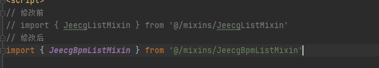
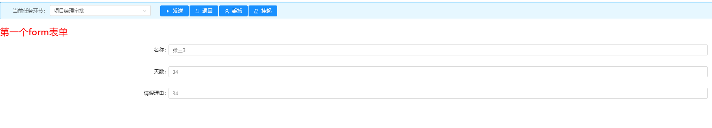
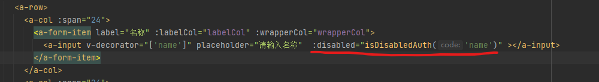

# 自定义表单流程

流程设计->流程设计->新建流程

## 绘制流程图


## 人员配置

1）	处理人，只可分配一个具体的人
2）	备选人员，可分配给多个人（选中人员都可以看到该任务，其中一人【签收】后，其他人任务在列表中消失）
3）	备选角色，分配给一个或者多个角色（（所属角色的人员都可以看到该任务，其中一人【签收】后，其他人任务在列表中消失））注意：先选择类型，再进行列表选择，最后点击选择，进行区域保存。最后点击流程保存按钮，结束。


## online表单配置


**注意：需要添加bpm_status字段，String类型，默认“1”，页面属性里取消表单显示，勾选列表显示，校验字段里字典Code填写‘bpm_status’**

## 代码生成

配置完成之后生成代码移动到合适的地方，配置菜单及权限

##  自定义表单流程配置

流程设计->流程设计->选择进行配置的流程，点击流程配置

选择业务关联，表单类型选择自定义开发，表面填写配置的表名(如果有多张表，填写主表名)，唯一编码可自动生成，也可手动填写，只要唯一就可，${表字段名}配置标题，配置完成点击发布


## 自定义表单提交流程

注:如果online表单生成代码自前已配置了bpm_status字段，生成的代码已有了提交流程，不需要配置该部分，只需要注意flowCode即可

###  添加提交流程按钮


### 修改混入




### 添加流程所需属性

flowCode:流程表单唯一标识，流程配置时使用

bpmStatusDictOptions:

formUrl:'web端审批表单页面'

formUrlMobile:手机端审批表单页面


### 引入组件


### 修改Columns中流程状态


#### 添加流程状态转换代码

```js
initDictConfig() {
  initDictOptions('bpm_status').then((res) => {
    if (res.success) {
      this.bpmStatusDictOptions=res.result
    }
  })
},
```

###  添加提交流程方法

```js
// 提交流程
startProcess(record) {
  console.log(record)
  var that = this
  this.$confirm({
    title: '提示',
    content: '确认提交流程吗？',
    onOk: function() {
      let param = {
        flowCode: that.flowCode,
        id: record.id,
        formUrl: that.formUrl, // pc端流程审批，默认展示的表单组件
        formUrlMobile: that.formUrlMobile        //  移动端流程审批，默认展示的表单组件
      }
      postAction(that.url.startProcess, param).then(res => {
        if (res.success) {
          that.$message.success(res.message)
          that.loadData()
          that.onClearSelected()
        } else {
          that.$message.warning(res.message)
        }
      })
    }
  })
},
```

## 表单流程办理

###  引入组件

```js
<!--审批详情-->
<bpm-process-track-modal ref='bpmProcessTrackModal' />
import BpmProcessTrackModal from '@views/modules/bpmbiz/common/BpmProcessTrackModal'
```

### 添加办理按钮

```html
<a-menu-item v-else-if="showBtn(record.bpmStatus) && queryParam.bizTaskType=='1'">
  <a @click="handleProcess(record)">办理</a>
</a-menu-item>
```

### 添加类型分类

```html
<a-form-item label='类型'>
  <a-radio-group
    v-model='queryParam.bizTaskType'
    @change='onBizTaskTypeChange'
  >
    <a-radio value='1'>待我审批</a-radio>
    <a-radio value='2'>我发起的申请</a-radio>
  </a-radio-group>
</a-form-item>
```

### 修改list接口

#### 添加依赖

```xml
<dependency>
    <groupId>org.jeecgframework.boot</groupId>
    <artifactId>jeecg-boot-module-joa</artifactId>
    <version>2.4.0</version>
</dependency>
```

#### 修改接口

```java
@AutoLog(value = "测试工作流-分页列表查询")
@ApiOperation(value="测试工作流-分页列表查询", notes="测试工作流-分页列表查询")
@GetMapping(value = "/list")
public Result<?> queryPageList(TestActiviti1 testActiviti1,
                        @RequestParam(name="pageNo", defaultValue="1") Integer pageNo,
                        @RequestParam(name="pageSize", defaultValue="10") Integer pageSize,
                        HttpServletRequest req) {
   QueryWrapper<TestActiviti1> queryWrapper = QueryGenerator.initQueryWrapper(testActiviti1, req.getParameterMap());
   Page<TestActiviti1> page = new Page<TestActiviti1>(pageNo, pageSize);
   /* 我的审批业务过滤 start */
   String userId = JwtUtil.getUserNameByToken(req);
   String bizTaskType = req.getParameter("bizTaskType");
   String flowCode = "dev_test_activiti1_001";
   JoaUtil.filterRunningTask(bizTaskType,queryWrapper,userId,flowCode);
   /* 我的审批业务过滤 end */
   IPage<TestActiviti1> pageList = testActiviti1Service.page(page, queryWrapper);
   return Result.OK(pageList);
```

## 添加审批进度

### 添加按钮


### 引入组件

```html
<!-- 审批进度    -->
<bpm-biz-task-deal-modal ref='taskDealModal' :path='path' :form-data='formData' @ok='handleOk' />
```

```js
//  流程进度
import BpmBizTaskDealModal from '@views/modules/bpmbiz/common/BpmBizTaskDealModal'
```

### 添加催办及催办提醒

#### 添加催办按钮


#### 引入组件

```js
// 流程催办
import BizTaskNotifyModal from '@views/modules/bpmbiz/common/BizTaskNotifyModal'
// 催办提醒
import BizTaskNotifyMeModal from '@views/modules/bpmbiz/common/BizTaskNotifyMeModal'
```

```html
<!--    催办-->
<biz-task-notify-modal ref='taskNotifyModal'></biz-task-notify-modal>
<!--  催办提醒  -->
<biz-task-notify-me-modal ref='taskNotifyMeModal'></biz-task-notify-me-modal>
```

#### 修改Columns


``

```js
async loadData(arg) {
  if (!this.url.list) {
    this.$message.error('请设置url.list属性!')
    return
  }        //加载数据 若传入参数1则加载第一页的内容
  if (arg === 1) {
    this.ipagination.current = 1
  }
  var params = this.getQueryParams()//查询条件
  this.loading = true
  let res = await getAction(this.url.list, params)
  if (res.success) {
    var data = res.result.records
    if (this.queryParam.bizTaskType == '1') {
      for (var i = 0; i < data.length; i++) {
        //item.taskUrge = false
        var item = data[i]
        var params = { flowCode: this.flowCode, dataId: item.id }//查询条件
        let res2 = await getAction(this.url.checkNotify, params)
        if (res2.result) {
          item.taskUrge = true
        }
      }
    }
    this.dataSource = data
    this.ipagination.total = res.result.total
    this.loading = false
  }
},
```

## 流程会签

选择会签节点进行人员配置，类型选择处理人，表达式填：${assigneeUserId}

会签属性设置：状态选择并行，(并行和顺序会签选择对应状态即可，其他不变)循环集合填：${flowUtil.stringToList(assigneeUserIdList)} ，元素名填：assigneeUserId


流程审批：因为下一步是会签节点，需要指定会签人员


##  不同审批节点选择不同的页面

流程设计->流程设计->流程配置->配置页面


效果图


## 流程节点权限配置

#### 策略规则

（1）	策略显示，反向有效  则字段不显示
（2）	策略显示，正向有效  则字段显示
（3）	策略禁用，反向有效  则字段可编辑
（4）	策略禁用，正向有效  则字段不可编辑

##### 显示权限添加

流程设计->流程设计->流程配置->流程节点->更多->权限配置


表单地址后面加  ?edit=1  如果加了之后表单出不来，将?换成&，即 &edit=1


###### 效果图

年龄已经隐藏



##### 禁用权限添加

###### 权限配置


###### 修改表单地址


###### 加入依赖

```js
// 引入禁用权限所需要代码
import { DisabledAuthFilterMixin } from '@/mixins/DisabledAuthFilterMixin'
```

```
mixins: [DisabledAuthFilterMixin],
```

###### 给所需要控制的字段上添加如下红色部分，name为配置的规则编码



###### 效果图

名词已经设为不可编辑了


## 流程作废

```html
<!-- 流程作废-->
 <a-menu-item v-if="record.bpmStatus === '2'">
      <a-popconfirm title='确定要作废流程吗?' @confirm='() => invalidProcess(record)'>
        <a>作废流程</a>
      </a-popconfirm>
    </a-menu-item>
<a-menu-item>
```

## 网关

### 分支网关

#### 修改流程图


配置对应分支上连线的分支条件，lale设置名称，表达式${total>3},total为表单字段

审批到该节点会根据条件走对应的分支


### 同步网关

#### 修改流程图

同一个并行网关有多个进入和多个外出顺序流。 它就同一时候具有分支和汇聚功能，这时，网关会先汇聚全部进入的顺序流，然后再切分成多个并行分支


### 包含网关

包含网关可以看做是排他网关和并行网关的结合体；和排他网关一样，你可以在外出顺序流上定义条件，包含网关会解析它们；但是主要的区别是包含网关可以选择多于一条顺序流，这和并行网关一样，包含网关的功能是基于进入和外出顺序流的；

分支：所有外出顺序流的条件都会被解析，结果为true的顺序会以并行方式继续执行，会为每个顺序流创建一个分支；
汇聚：所有并行分支达到包含网关，会进入等待状态，知道每个包含流程token的进入顺序流的分支都到达；这是与并行网关的


普通员工分支线上表达式配置：

领导分支线上表达式配置：


全部分支线上表达式配置：


## 流程监听

### 执行监听

#### 书写后端代码

实现org.activiti.engine.delegate.ExecutionListener接口

```java
@Component("testActivitiListener")
@Slf4j
public class TestActivitiListener implements ExecutionListener {
    @Override
    public void notify(DelegateExecution execution) throws Exception {
        log.info("流程监听start。。。。。。。。。。。。。。。。。。。。。。。。。。。。。。。");
        Map<String, Object> map = execution.getVariables();
        map.forEach((k, v) -> {
            log.info(String.format("k:[%s],v:[%s]", k, v));
        });
        // 表单主键ID
        String bpmDataId = (String) execution.getVariable(WorkFlowGlobals.BPM_DATA_ID);
        // 表单对应的表名
        String businessKey = (String) execution.getVariable(WorkFlowGlobals.BPM_FORM_KEY);
        log.info(String.format("DataId:%s,\tformKey:%s",bpmDataId,businessKey));
        log.info("流程监听end。。。。。。。。。。。。。。。。。。。。。。。。。。。。。。。");

    }
}
```

#### 添加流程监听

监听类型选执行监听，event属性选择要监听的位置


#### 配置监听

在流程设计图里空白处右键点击属性添加执行监听


#### 效果图

流程提交之后执行的业务代码


### 任务监听

#### 书写后端代码

实现org.activiti.engine.delegate.TaskListener接口

```java
@Component("testActivitiTaskListener")
@Slf4j
public class TestActivitiTaskListener implements TaskListener {
    private static final long serialVersionUID = 1L;
    private static IExtActProcessService extActProcessService;

    static {
        extActProcessService = SpringContextUtils.getBean(IExtActProcessService.class);
    }

    @Override
    public void notify(DelegateTask delegateTask) {
        String processInstanceId = delegateTask.getProcessInstanceId();
        log.info("实例ID:[{}]",processInstanceId);
        DelegateExecution execution = delegateTask.getExecution();
        // 表单主键ID
        String bpmDataId = (String) execution.getVariable(WorkFlowGlobals.BPM_DATA_ID);
        // 表单对应的表名
        String businessKey = (String) execution.getVariable(WorkFlowGlobals.BPM_FORM_KEY);
        // 表单数据
        Map<String, Object> dataForm = extActProcessService.getDataById(businessKey, bpmDataId);
        if (dataForm != null) {
            log.info("流程任务监听======================================");
            dataForm.forEach((k, v) -> {
                log.info("k:[{}],V:[{}]",k,v);
                // 重新赋值
                execution.setVariable(k, v);
            });
        }
    }
}
```

#### 添加流程监听

监听类型选任务监听，event属性选择要监听的位置


#### 配置监听

在流程设计图需要监听的节点配置任务监听


#### 效果图

当流程走到该节点时执行的业务代码


## 流程表达式

### 书写后端代码

```java
/**
 * 测试工作流表达式
 */
@Component("testActivitiExpression")
@Slf4j
public class TestActivitiExpression {
    /**
     * 判断请假天数是否大于3
     * @param total
     * @return
     */
    public boolean isGtrThree(Integer total) {
        return total > 3;
    }
}
```


### 配置表达式

流程正常执行


## 流程相关表

```sql
-- 流程定义表
SELECT *,CONVERT(process_xml USING utf8) FROM ext_act_process WHERE process_name='流程培训1';
-- 流程节点定义表
SELECT * FROM ext_act_process_node WHERE process_id='1381516149048684545';
SELECT * FROM ext_act_process_node node LEFT JOIN ext_act_process process ON node.process_id=process.id WHERE process.process_name='流程培训1';
-- 流程节点授权表
SELECT * FROM ext_act_process_node_auth WHERE process_id='1381516149048684545';
SELECT * FROM ext_act_process_node_auth auth LEFT JOIN ext_act_process process ON auth.process_id=process.id WHERE process.process_name='流程培训1';
-- 流程表单管理表
SELECT * FROM ext_act_process_form WHERE process_id='1381516149048684545';
-- 流程监听表
SELECT * FROM ext_act_listener;
-- 流程表达式表
SELECT * FROM ext_act_expression;
-- online表单表
SELECT * FROM onl_cgform_head;
-- online表单字段表
SELECT * FROM onl_cgform_field;
-- 表单设计器表
SELECT * FROM design_form;
-- 表单设计权限表
SELECT * FROM design_form_auth;
```

## 批量操作

### 添加按钮

```html
<!--流程按钮start-->
<a-button @click='batchComplete' type='primary' icon='caret-right'>批量发送</a-button>
<a-button @click='batchReject' type='primary' icon='rollback'>批量退回</a-button>
<a-button @click='batchEntruster' type='primary' icon='user'>批量委托</a-button>
<a-button @click='batchSuspend' type='primary' icon='lock'>批量挂起</a-button>
<a-button @click='batchRestart' type='primary' icon='unlock'>批量解挂</a-button>
<!--流程按钮end-->
```

### 导入组件

```js
// 流程批量发送
import BpmBizBatchCompleteDealModal from '@views/modules/bpmbiz/common/BpmBizBatchCompleteDealModal'
//流程批量退回
import BpmBizBatchRejectDealModal from '@views/modules/bpmbiz/common/BpmBizBatchRejectDealModal'
// 流程批量委托
import BpmBizBatchEntrusterDealModal from '@views/modules/bpmbiz/common/BpmBizBatchEntrusterDealModal'
// 流程批量挂起
import BpmBizBatchSuspendDealModal from '@views/modules/bpmbiz/common/BpmBizBatchSuspendDealModal'
// 流程批量解挂
import BpmBizBatchRestartDealModal from '@views/modules/bpmbiz/common/BpmBizBatchRestartDealModal'
```

```html
<!--流程批量发送操作-->
<bpm-biz-batch-complete-deal-modal ref='batchCompleteDealModal' @ok='handleOk'></bpm-biz-batch-complete-deal-modal>
<!--    流程批量退回操作-->
<bpm-biz-batch-reject-deal-modal ref='batchRejectDealModal' @ok='handleOk'></bpm-biz-batch-reject-deal-modal>
<!--    流程批量委托-->
<bpm-biz-batch-entruster-deal-modal ref='batchEntrusterDealModal'
                                    @ok='handleOk'></bpm-biz-batch-entruster-deal-modal>
<!--流程批量挂起-->
<bpm-biz-batch-suspend-deal-modal ref='batchSuspendDealModal' @ok='handleOk'></bpm-biz-batch-suspend-deal-modal>
<!--    流程批量解挂-->
<bpm-biz-batch-restart-deal-modal ref='batchRestartDealModal' @ok='handleOk'></bpm-biz-batch-restart-deal-modal>
```

### 添加方法

```js
// 批量发送
batchComplete() {
  var that = this
  var rows = that.selectionRows
  if (rows.length <= 0) {
    this.$message.warning('请选择一条记录')
    return
  }
  var param = { data: [] }
  for (let i = 0; i < rows.length; i++) {
    var data = { dataId: rows[i].id, flowCode: that.flowCode, bizTitle: rows[i].name }
    param.data.push(data)
  }
  that.$refs.batchCompleteDealModal.deal(param)
  that.$refs.batchCompleteDealModal.title = '批量发送'

},
// 批量退回
batchReject() {
  let that = this
  let rows = that.selectionRows
  if (rows.length <= 0) {
    this.$message.warning('请选择一条记录')
    return
  }
  let param = { data: [] }
  rows.forEach((row) => {
    let data = { dataId: row.id, flowCode: that.flowCode, bizTitle: row.kuName }
    param.data.push(data)
  })
  /*  for (let i = 0; i < rows.length; i++) {
      let data = { dataId: rows[i].id, flowCode: that.flowCode, bizTitle: rows[i].name }
      param.data.push(data)
    }*/
  that.$refs.batchRejectDealModal.deal(param)
  that.$refs.batchRejectDealModal.title = '批量退回'

},
//批量委托
batchEntruster() {
  let that = this
  let rows = that.selectionRows
  if (rows.length <= 0) {
    this.$message.warning('请选择一条记录！')
    return
  }
  let param = { data: [] }
  for (let i = 0; i < rows.length; i++) {
    var data = { dataId: rows[i].id, flowCode: that.flowCode, bizTitle: rows[i].name }
    param.data.push(data)
  }
  that.$refs.batchEntrusterDealModal.deal(param)
  that.$refs.batchEntrusterDealModal.title = '批量委托'
},
//批量挂起
batchSuspend() {
  var that = this
  let rows = that.selectionRows
  if (rows.length <= 0) {
    this.$message.warning('请选择一条记录！')
    return
  }
  let param = { data: [] }
  for (let i = 0; i < rows.length; i++) {
    let data = { dataId: rows[i].id, flowCode: that.flowCode, bizTitle: rows[i].name }
    param.data.push(data)
  }
  that.$refs.batchSuspendDealModal.deal(param)
  that.$refs.batchSuspendDealModal.title = '批量挂起'
},
//批量解挂
batchRestart() {
  let that = this
  let rows = that.selectionRows
  if (rows.length <= 0) {
    this.$message.warning('请选择一条记录！')
    return
  }
  let param = { data: [] }
  for (let i = 0; i < rows.length; i++) {
    let data = { dataId: rows[i].id, flowCode: that.flowCode, bizTitle: rows[i].name }
    param.data.push(data)
  }
  that.$refs.batchRestartDealModal.deal(param)
  that.$refs.batchRestartDealModal.title = '批量解挂'
},
```

## 脚本任务


```java
@Service
@Slf4j
public class TestActiviti1ServiceImpl extends ServiceImpl<TestActiviti1Mapper, TestActiviti1> implements ITestActiviti1Service {

    @Autowired
    private RuntimeService runtimeService;

    @Override
    public void setType(DelegateExecution execution) {
        log.info("脚本任务：start.....");
        String id = (String) execution.getVariable("id");
        TestActiviti1 testActiviti = getById(id);
        log.info(testActiviti.toString());
        String processInstanceId = execution.getProcessInstanceId();
        log.info("实例Id:[{}]", processInstanceId);
        runtimeService.setVariable(processInstanceId, "type", "1");
       log.info("脚本任务：end.....");
    }
}
```


## 子流程

### 绘制子流程

设置ID,


添加子流程，设置子流程属性，填写**子流程名称**，子流程名称就是子流程的流程编码(ID)


设置参数配置，设置输入输出参数


